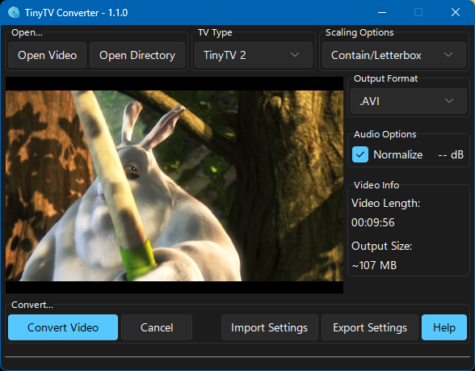

# TinyTV Video Converter App

## Application Preview



## Packaged Binaries

[Official Download Page](https://tinytv.us/TinyTV-Converter-App/)

### Python Dependencies

```
sv-ttk
darkdetect
tkinterdnd2
psutil
```

### Other Dependencies

```
FFMPEG
```

[MacOS FFMPEG binaries](https://evermeet.cx/ffmpeg/)

[Windows FFMPEG binaries](https://www.gyan.dev/ffmpeg/builds/)

## Running From Source

- Install Python dependencies with `python3 -m pip install ...`
- Place `ffmpeg(.exe)` into the top-level directory of the cloned repository.
- Execute `python3 TinyTVConverter.py`

## App Instructions
